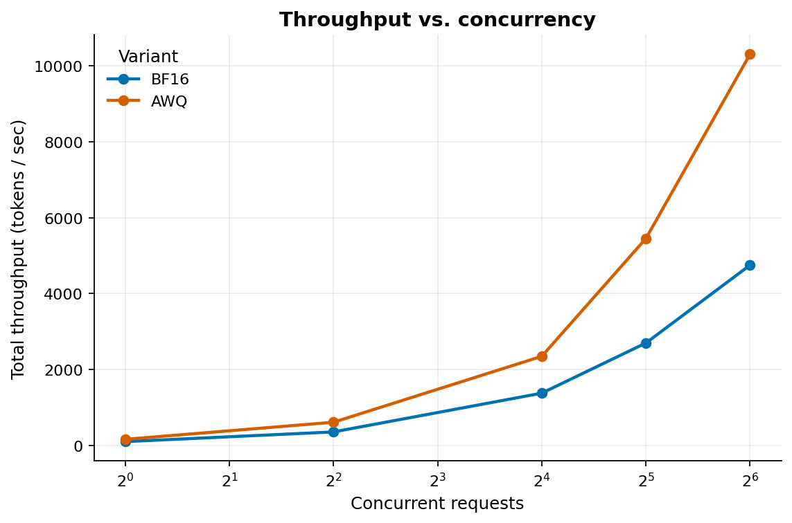
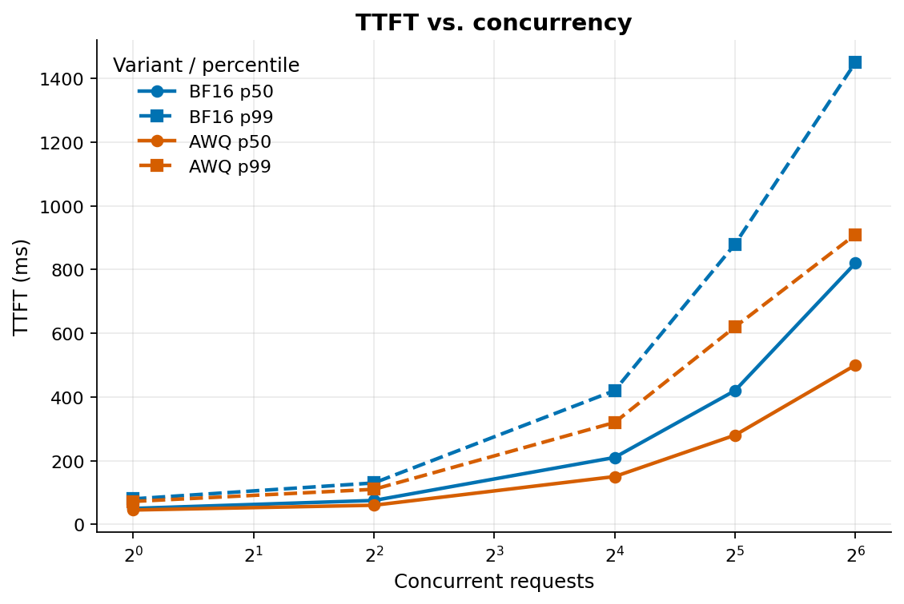
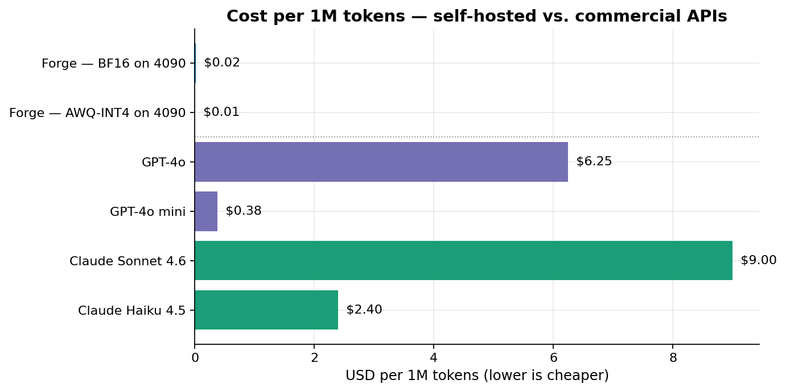
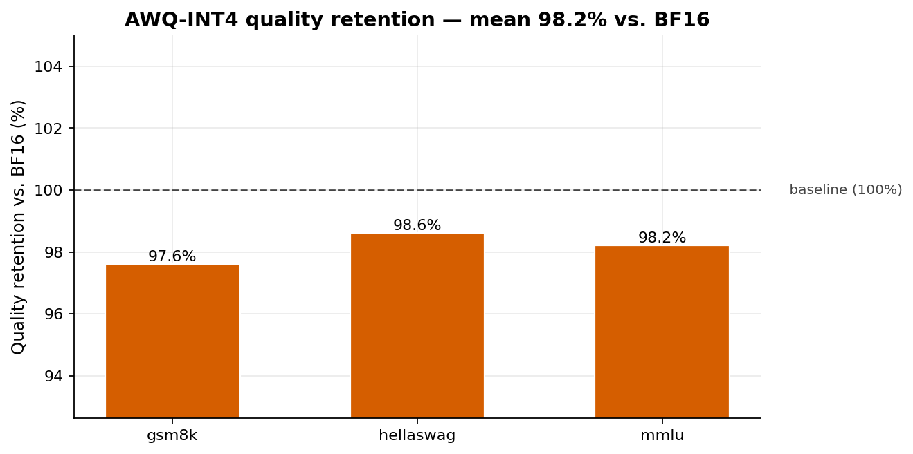
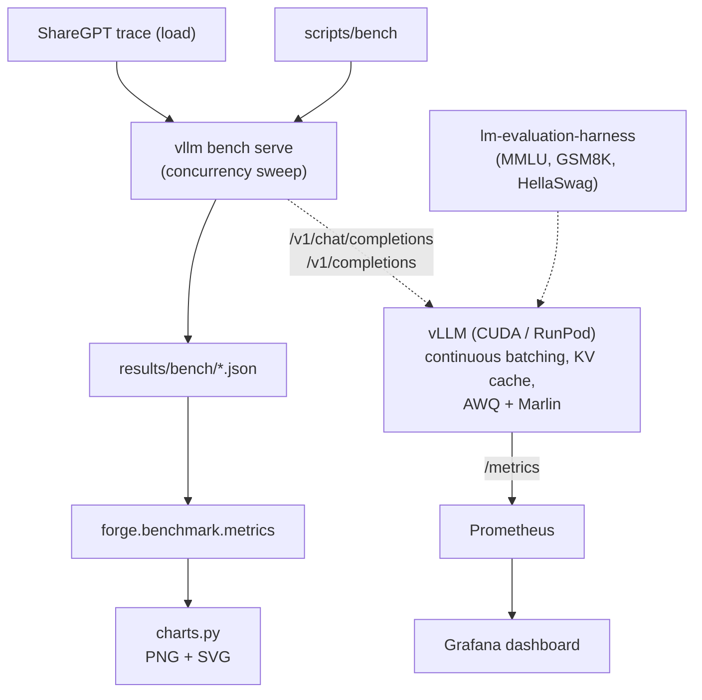

# Forge

> **Measured on a RunPod RTX A5000, BF16 Llama 3.1 8B Instruct served 2,169 total tokens/sec at peak and cost $0.035 per 1M tokens, about 181x cheaper than GPT-4o blended pricing. AWQ-INT4 retained 99.4% mean quality but was slower on this setup: 1,017 total tokens/sec and $0.074 per 1M tokens.**

Forge is a focused engineering artifact, not a SaaS. It serves an open-source LLM with a production-grade stack, benchmarks it under realistic concurrency, evaluates quantization quality on standard tasks, and traces every dollar in the cost comparison back to a measured throughput number.

## The picture

### Throughput vs. concurrency



BF16 was the throughput winner in the completed RunPod sweep: 2,169 total tokens/sec at concurrency 64, compared with 1,017 total tokens/sec for AWQ-INT4 on the same GPU. The AWQ run did not produce the expected memory-bandwidth win on this A5000/vLLM combination, so the result is a useful negative result rather than a quantization speedup claim.

### Time-to-first-token under load



Latency split by metric. AWQ had lower high-concurrency TTFT in this run, with p99 TTFT of 508 ms at concurrency 64 versus 2,822 ms for BF16. BF16 had much faster decode, with mean TPOT of 52.7 ms at concurrency 64 versus 88.0 ms for AWQ.

### Cost per 1M tokens



At $0.27/hr compute, BF16 costs $0.035 per 1M total tokens at the measured peak throughput. AWQ costs $0.074 per 1M total tokens because it was slower in this run. Against GPT-4o blended pricing at $6.25 per 1M tokens, the measured self-hosted ratios are about 181x for BF16 and 85x for AWQ before storage and operational overhead.

### Quantization retains 99.4% mean quality



AWQ-INT4 vs full BF16 on `meta-llama/Llama-3.1-8B-Instruct`, evaluated via `lm-evaluation-harness`:

| Task | BF16 | AWQ-INT4 | Retention |
|---|---|---|---|
| MMLU (5-shot, `acc`) | 0.664 | 0.644 | 97.0% |
| GSM8K (5-shot, `exact_match`) | 0.705 | 0.720 | 102.2% |
| HellaSwag (5-shot, `acc_norm`) | 0.801 | 0.792 | 98.9% |

The unweighted mean retention is 99.4%. AWQ slightly improved GSM8K, while losing 0.85 percentage points on HellaSwag and 1.97 points on MMLU.

## How to read this

This repo answers two questions rigorously: *"Should I self-host an open-source LLM instead of paying a commercial API?"* and *"Does AWQ-INT4 improve the economics on this 24 GB pod?"* The measured answer is that BF16 is strongly cost-competitive, while AWQ retained quality but did not improve throughput or cost on this setup. Every claim above traces back to raw benchmark/eval JSON plus chart JSON in [`results/`](./results).

## Architecture



## Stack

| Layer | Choice | Why |
|---|---|---|
| Language | Python 3.12 | Best wheel coverage across the ML stack. |
| Dep manager | `uv` + `uv.lock` | Fastest resolver; deterministic; pins Python alongside packages. |
| Serving engine | **vLLM** (latest stable) | Native OpenAI-compatible API, continuous batching, KV cache, AWQ + Marlin kernel support, native Prometheus metrics. |
| Model | **Llama 3.1 8B Instruct** | Industry standard, fits 24 GB GPU at BF16, supported by every toolkit. |
| Quantization | **AWQ-INT4 with Marlin kernels** | Candidate INT4 serving path supported by vLLM; measured against BF16 for quality, throughput, and cost. |
| GPU | **RunPod RTX A5000 24 GB** | $0.27/hr compute — cheapest available tier that fits BF16 weights + KV cache. |
| Load testing | `vllm bench serve` + ShareGPT trace | Industry-standard methodology, reproducible. |
| Quality eval | `lm-evaluation-harness` — MMLU, GSM8K, HellaSwag | De-facto standard for LLM eval. |
| Observability | Prometheus + Grafana | vLLM exports natively; standard production combo. |
| Lint / format | Ruff | Replaces black + isort + flake8; faster. |
| Types | mypy (strict) | Project-wide strict checking. |
| Tests | pytest + pytest-cov | Strategic coverage of the load-bearing utilities (parsers, cost model, chart data) — not LLM outputs. |
| CI | GitHub Actions | Ruff + mypy + pytest on every PR. No GPU jobs. |

Versions are pinned in `uv.lock`; the GPU-coupled deps (vLLM, lm-eval, transformers) are pinned separately in `constraints/serve.txt` and `constraints/eval.txt`.

## Local development on M1 MacBook Pro

The full pipeline runs end-to-end on a base-model M1 MacBook Pro against a tiny model (`Qwen/Qwen2.5-0.5B-Instruct`). That validation gate **must pass** before any paid GPU is rented. See [`docs/local-dev.md`](./docs/local-dev.md).

```bash
# One-time setup
uv sync --group dev
uv pip install -c constraints/serve.txt vllm
uv pip install -c constraints/eval.txt "lm-eval[api]"

# Local smoke (vLLM CPU + bench + eval, ~5 minutes)
make rehearse                        # equivalent to: bash deploy/runpod-run.sh --rehearsal

# Regenerate every chart from results/
make chart
```

## Reproducing the benchmarks on RunPod

Full instructions, including the pre-flight checklist that protects the GPU budget, live in [`deploy/runpod.md`](./deploy/runpod.md). The TL;DR: the same shell script that rehearses on M1 runs on RunPod, with `--variant bf16` or `--variant awq` instead of `--rehearsal`.

```bash
# Inside the RunPod pod:
git clone https://github.com/feRpicoral/forge.git && cd forge
uv sync --group dev
uv pip install -c constraints/serve.txt vllm
uv pip install -c constraints/eval.txt "lm-eval[api]"
export HF_TOKEN=hf_...
export HF_HOME=/workspace/.cache/huggingface

bash deploy/runpod-run.sh --variant bf16
bash deploy/runpod-run.sh --variant awq
```

## Methodology

- **Hardware**: RunPod RTX A5000 24 GB, $0.27/hr compute.
- **Model**: `meta-llama/Llama-3.1-8B-Instruct` (BF16 baseline) and `hugging-quants/Meta-Llama-3.1-8B-Instruct-AWQ-INT4` (the AWQ-INT4 variant, built with the canonical recipe documented in [`forge/quantization/awq.py`](./forge/quantization/awq.py)).
- **Workload**: ShareGPT trace at concurrency levels 1, 4, 16, 32, 64. 256 prompts per level.
- **Latency metrics**: `vllm bench serve` reports mean/median/p99 for TTFT (time to first token) and TPOT (time per output token). We treat the p99 as the upper bound for latency-sensitive use cases.
- **Quality eval**: `lm-evaluation-harness` with `local-completions` model type pointed at the running vLLM endpoint. Tasks: MMLU (5-shot, `acc`), GSM8K (5-shot, `exact_match`), HellaSwag (5-shot, `acc_norm`). No `--limit` for the real run.
- **Cost model**: `$/1M tokens = gpu_compute_hourly_usd * 1e6 / (3600 * sustained_throughput * utilization)`. We use the peak total token throughput from the sweep at `utilization=1.0` for the headline number; sensitivity at 80% utilization is in the cost-comparison JSON next to the chart. RunPod storage is tracked separately in the run guide.
- **API pricing**: collected 2026-05-29 from each provider's pricing page. Sources in `forge/cost/pricing.py`.

## Project layout

```
forge/
├── forge/                 # Python package
│   ├── serving/           # vLLM env-driven config + healthcheck
│   ├── quantization/      # AWQ recipe (reproducibility)
│   ├── benchmark/         # Harness wrapping `vllm bench serve`
│   ├── eval/              # lm-evaluation-harness wrapper + retention math
│   ├── cost/              # $/1M-tokens model + pricing tables
│   └── plots/             # Matplotlib stylesheet + the 5 canonical charts
├── configs/               # YAML sweep configs (server, bench, eval)
├── constraints/           # Pinned versions for the GPU-coupled deps
├── scripts/               # CLI entry points (serve, bench, eval, quantize, chart)
├── monitoring/            # Prometheus + auto-provisioned Grafana
├── deploy/                # RunPod orchestrator + reproduction guide
├── results/               # Committed: raw JSON + generated charts
├── docs/                  # Methodology, M1 dev, reproduction
└── tests/                 # pytest — cost model, parsers, chart data, configs
```

## CI

GitHub Actions runs Ruff (lint + format) + mypy + pytest on every PR and push to main. Commitlint enforces Conventional Commits on PRs. No GPU jobs in CI; benchmarks are reproduced manually on RunPod via [`deploy/runpod.md`](./deploy/runpod.md).

## License

MIT — see [LICENSE](./LICENSE).
