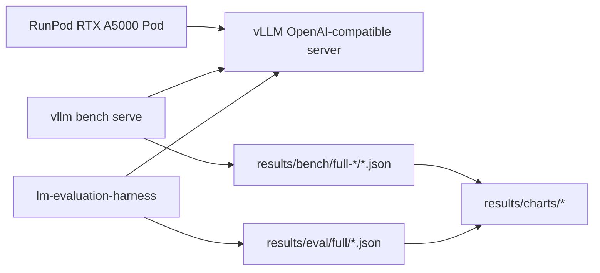

# Methodology

Forge reports measured artifacts only: `results/bench/full-*`, `results/eval/full/`, and `results/charts/` are the canonical sources for published claims.

## Benchmark

The benchmark target is `meta-llama/Llama-3.1-8B-Instruct` on a single RunPod RTX A5000 pod. The BF16 baseline uses the gated Meta checkpoint. The quantized variant uses `hugging-quants/Meta-Llama-3.1-8B-Instruct-AWQ-INT4`.

The orchestrator starts vLLM, waits for `/health`, runs `vllm bench serve` against the OpenAI-compatible chat endpoint, then runs `lm-evaluation-harness` against the same server.

The full sweep uses concurrency levels `1, 4, 16, 32, 64` and `256` ShareGPT prompts per level. The cost headline uses the peak sustained total-token throughput from that sweep.

## Evaluation

Quality retention compares AWQ-INT4 to BF16 using MMLU, GSM8K, and HellaSwag at 5-shot with no limit. The chart reports per-task retention and the unweighted mean retention across tasks.

## Pricing

GPU compute and API prices are point-in-time constants in `forge/cost/pricing.py`. Before publishing final numbers, refresh those constants, run `make chart`, and update README claims from the regenerated JSON. RunPod storage is tracked in `deploy/runpod.md` and kept out of the token-cost formula so the GPU comparison stays consistent with provider compute pricing.
